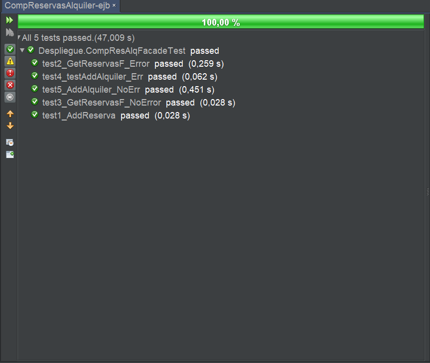
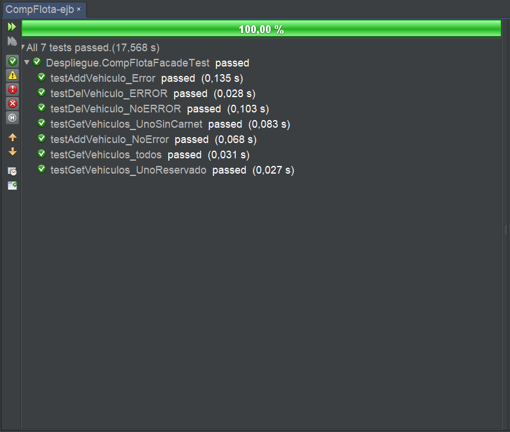
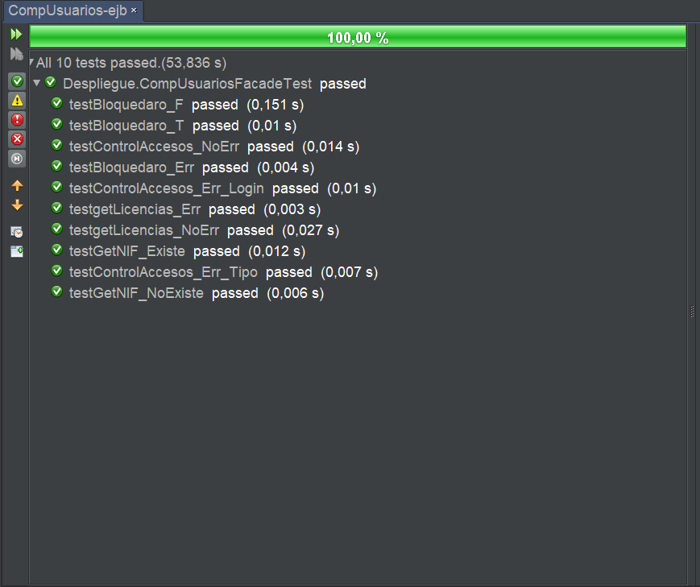

# Alumnos: Iván González Rincón, Pablo Renero Balgañón.

## Componente Alquiler
En este caso hicimos uso de una interfaz local.

## Componente Flota
En este caso hicimos uso de una interfaz remota, por existir dependencias externas con el componente Flota, que hace uso del componente Alquiler.

## Componente Usuario
En este caso hicimos uso de una interfaz local.

Nota: para ejecutar los test hemos tenido que resetear los valores de la base de datos entre ejecuciones. Esto es debido a una gran dependencia entre ambos y a no resetear a los valores originales entre ejecuciones.